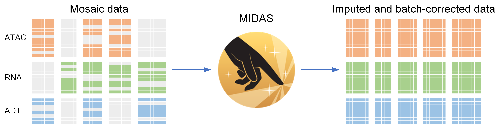

# MIDAS

Please see the [**instruction**](https://sc-midas-docs.readthedocs.io/en/latest/) for reproducing the manuscript results.

      
    MIDAS turns mosaic data into imputed and batch-corrected data to support single-cell multimodal analysis.

## File description

| File or directory | Description                                                 |
| ------------------- | ------------------------------------------------------------- |
| `comparison/`     | Scripts for algorithm comparison and qualitative evaluation |
| `configs/`        | Dataset configuration and MIDAS model configuration         |
| `eval/`           | Scripts for quantitative evaluation                         |
| `functions/`      | PyTorch functions for MIDAS                                 |
| `modules/`        | PyTorch models and dataloader for MIDAS                     |
| `preprocess/`     | Scripts for data preprocessing                              |
| `utils/`          | Commonly used functions                                     |
| `README.md`       | This file                                                   |
| `run.py`          | Script for MIDAS training and inference                     |

