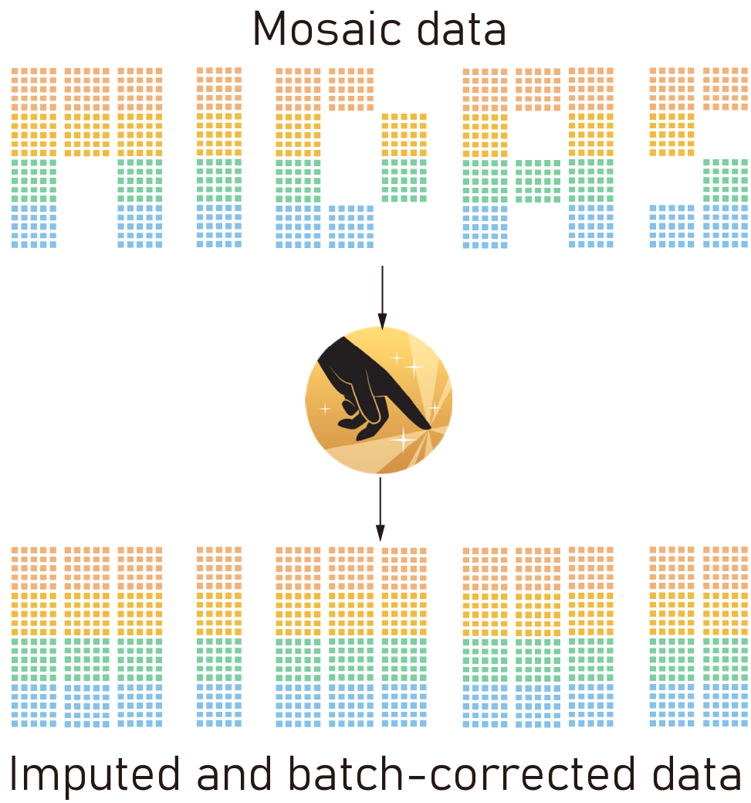
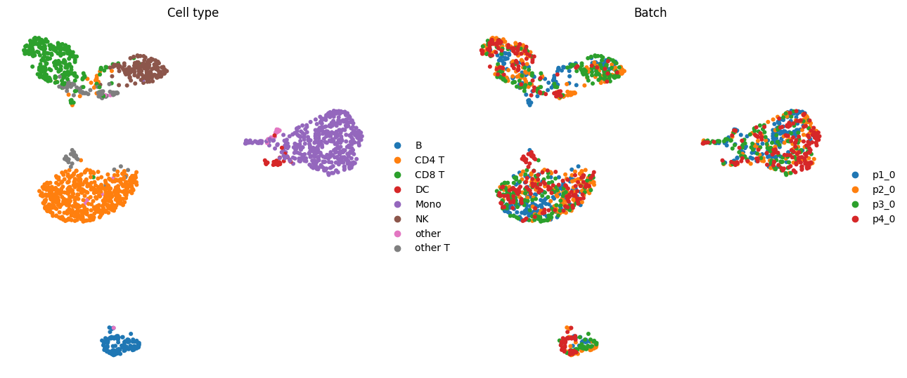

# MIDAS

<div align="center">
  
</div>

<p align="center">
  MIDAS turns raw mosaic single-cell multimodal data into <strong>imputed</strong>, <strong>batch-corrected matrices</strong> and <strong>disentangled latent representations</strong>.
</p>

<p align="center">
  <a href="https://github.com/labomics/midas/actions/workflows/test.yml"></a>
  <a href="https://pypi.org/project/scmidas/"></a>
  <a href="https://scmidas.readthedocs.io/en/latest/"></a>
  <a href="https://github.com/labomics/midas/blob/main/LICENSE"></a>
  <a href="https://colab.research.google.com/github/labomics/midas/blob/main/examples/quickstart.ipynb"></a>
  <a href="https://github.com/labomics/midas/stargazers"></a>
</p>

**Documentation:** [scmidas.readthedocs.io](https://scmidas.readthedocs.io/en/latest/)

## Key features

*   **Mosaic integration** — handle datasets where different batches measure different modality combinations (e.g. some batches have RNA + ATAC, others only RNA).
*   **Multi-modal support** — RNA, ADT, ATAC out of the box; configurable for additional modalities.
*   **Imputation** — fill in missing modalities with model-derived values.
*   **Batch correction** — remove technical variation across batches.
*   **Knowledge transfer** — fine-tune a pre-trained reference model on a query dataset.
*   **Multi-GPU training** — built on PyTorch Lightning, with DDP support for mosaic data.
*   **TensorBoard integration** — live training loss and UMAP visualisations.

## Installation

```bash
conda create -n scmidas python=3.12
conda activate scmidas
pip install scmidas
```

## Quick start

A bundled 1600-cell PBMC RNA+ADT mosaic dataset lets you go from `pip install` to a UMAP in about a minute on a single GPU — no extra downloads, no config files. Click the [Colab badge](https://colab.research.google.com/github/labomics/midas/blob/main/examples/quickstart.ipynb) to run it without installing anything, or copy the snippet:

```python
import scanpy as sc
import scmidas

mdata = scmidas.datasets.quickstart()       # bundled toy MuData
model = scmidas.integrate(mdata)            # ~1 min on a mid-range GPU; writes mdata.obsm['X_midas']
sc.pp.neighbors(mdata, use_rep='X_midas')   # any scanpy downstream works directly
```

This produces lineage-separated clusters that mix freely across batches:

<div align="center">
  
</div>

> ⚠️ **`scmidas.integrate()` defaults are tuned for the bundled toy dataset.** For your own data, override `max_epochs` (1000-2000 is typical) and consider letting `batch_size` default back to 256, e.g. `scmidas.integrate(my_mdata, max_epochs=2000, batch_size=256)`. See the [full demos](https://scmidas.readthedocs.io/en/latest/) for end-to-end pipelines on real-sized data, including imputation, batch correction, and cross-modality translation.

## Bring your own data

If you already have an :class:`AnnData` per modality, the bridge to MIDAS is one cell:

```python
import mudata as mu
import scmidas

mdata = mu.MuData({'rna': adata_rna, 'adt': adata_adt})  # share a 'batch' obs column
scmidas.MIDAS.setup_mudata(mdata, batch_key='batch')
model = scmidas.MIDAS(mdata)
model.train(max_epochs=2000)
mdata.obsm['X_midas'] = model.get_latent_representation()
```

For a full scanpy-native walkthrough (download a 10x CITE-seq sample → QC → HVG → MuData → MIDAS), see [Preparing your data](https://scmidas.readthedocs.io/en/latest/tutorials/basics/preparing_your_data.html). For the data contract (what goes where in the MuData), see [Data layout](https://scmidas.readthedocs.io/en/latest/tutorials/basics/data_layout.html).

## Reproducibility

Code and data to reproduce the results in the paper live on the [`reproducibility`](https://github.com/labomics/midas/tree/reproducibility) branch.

## Citation

If you use MIDAS in your research, please cite:

```bibtex
@article{he2024mosaic,
  title   = {Mosaic integration and knowledge transfer of single-cell multimodal data with {MIDAS}},
  author  = {He, Zhen and Hu, Shuofeng and Chen, Yaowen and An, Sijing
             and Zhou, Jiahao and Liu, Runyan and Shi, Junfeng and Wang, Jing
             and Dong, Guohua and Shi, Jinhui and Zhao, Jiaxin and Ou-Yang, Le
             and Zhu, Yuan and Bo, Xiaochen and Ying, Xiaomin},
  journal = {Nature Biotechnology},
  volume  = {42},
  number  = {10},
  pages   = {1594--1605},
  year    = {2024},
  doi     = {10.1038/s41587-023-02040-y},
  publisher = {Nature Publishing Group}
}
```

## Contributing

Bug reports and feature requests: please open a [GitHub issue](https://github.com/labomics/midas/issues). For code contributions, branch from `main`, make sure `pytest tests/` passes, and open a pull request — for non-trivial changes, an issue first to discuss the design is appreciated.

## License

[MIT](https://github.com/labomics/midas/blob/main/LICENSE).
