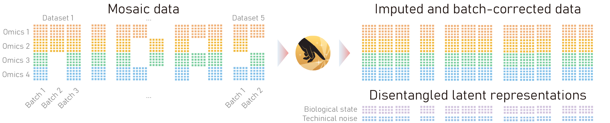

# MIDAS: a deep generative model for mosaic integration and knowledge transfer of single-cell multimodal data.

<div align=center>

</div>

<p align="center"> MIDAS turns mosaic data into imputed and batch-corrected data to support single-cell multimodal analysis. </p>

<p align="center">
  Read our paper at <a href="https://www.nature.com/articles/s41587-023-02040-y" target="_blank">Mosaic integration and knowledge transfer of single-cell multimodal data with MIDAS</a>.
</p>

<p align="center">
  Read our documentation at <a href="https://scmidas.readthedocs.io/en/latest/" target="_blank">https://scmidas.readthedocs.io/en/latest/</a>.
</p>

## Installation
```bash
conda create -n scmidas python=3.12
conda activate scmidas
pip install scmidas
```

## 🔥New

> - Allow sparse matrix input (.mtx).
> - MIDAS supports not only RNA, ADT, and ATAC data but also allows seamless integration of additional modalities with straightforward configuration.
> - Leverages PyTorch Lightning for efficient training, including advanced strategies such as distributed data parallel (DDP).
> - Integrates with TensorBoard for real-time visualization and tracking of loss and umap.

## Reproducibility

<p >
  Refer to <a href="https://github.com/labomics/midas/tree/reproducibility/" target="_blank">https://github.com/labomics/midas/tree/reproducibility/</a>.
</p>

## Citation

If you use MIDAS in your work, please cite the midas publication as follows:

```
@article{he2024mosaic,
  title={Mosaic integration and knowledge transfer of single-cell multimodal data with MIDAS},
  author={He, Zhen and Hu, Shuofeng and Chen, Yaowen and An, Sijing and Zhou, Jiahao and Liu, Runyan and Shi, Junfeng and Wang, Jing and Dong, Guohua and Shi, Jinhui and others},
  journal={Nature Biotechnology},
  pages={1--12},
  year={2024},
  publisher={Nature Publishing Group US New York}
}
```
