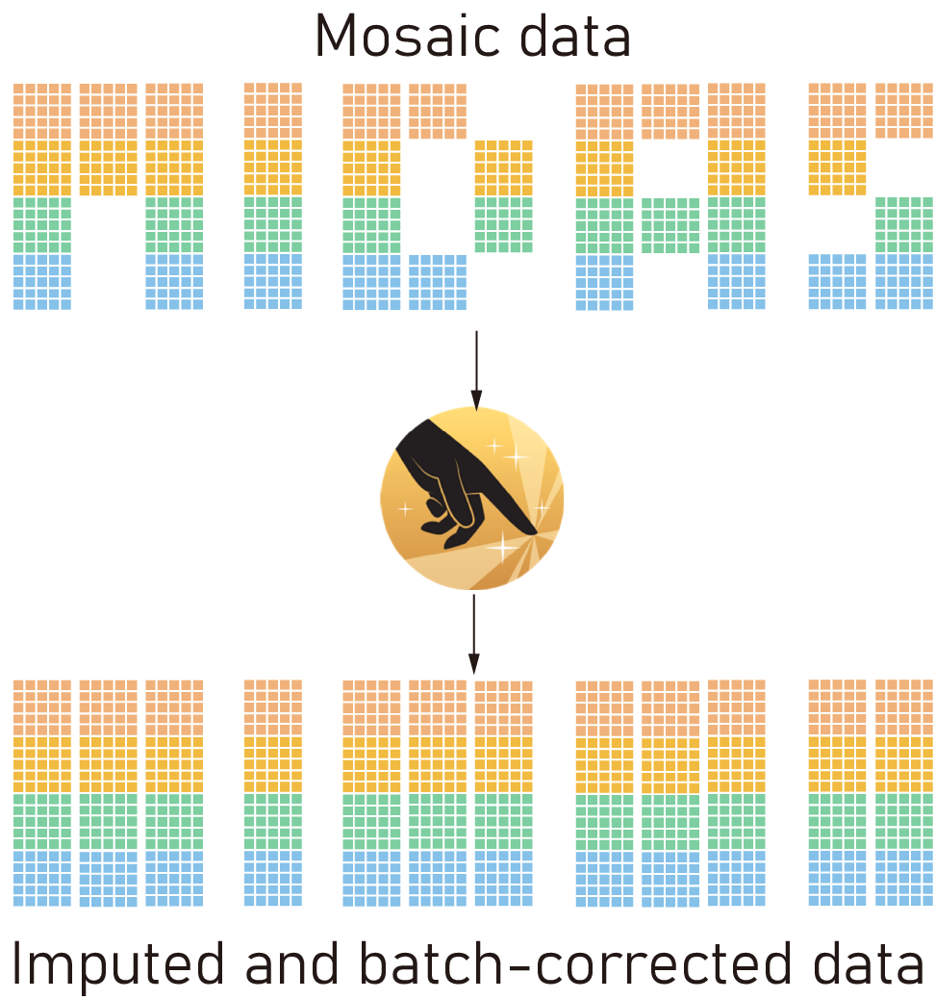

.. midas-dev documentation master file, created by
   sphinx-quickstart on Wed Jan 17 14:04:49 2024.
   You can adapt this file completely to your liking, but it should at least
   contain the root `toctree` directive.

Welcome to MIDAS's documentation!
=======================================

   MIDAS turns mosaic data into imputed and batch-corrected data to support single-cell multimodal analysis.

.. toctree::
   :maxdepth: 3
   :caption: Contents:

   installation.md
   ./tutorials/tutorial_index.rst
   ./modules/modules_index.rst
   release.md

