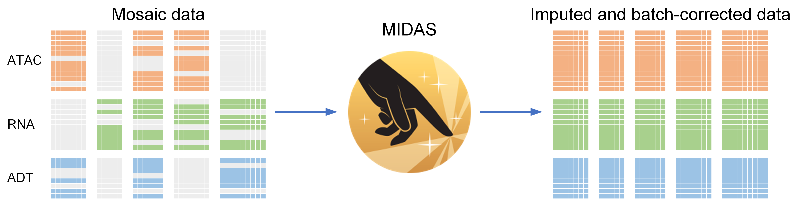

Tutorials
=========

   MIDAS turns mosaic data into imputed and batch-corrected data to support single-cell multimodal analysis.

.. toctree::
   :maxdepth: 2
   :caption: Contents:

   notebooks/tutorial_1.ipynb
   notebooks/tutorial_2.ipynb