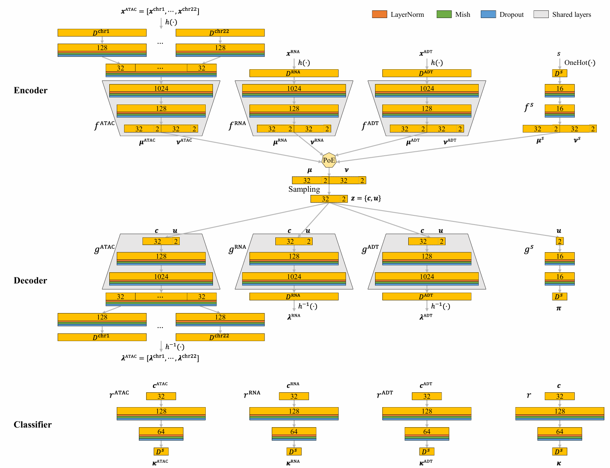

Development Instructions
========================

MIDAS currently supports integration of RNA, ADT, and ATAC data. If you'd like to develop the model, follow the instructions below.

Framework Overview
~~~~~~~~~~~~~~~~~~~

MIDAS is configured via the ``scmidas.config()`` and primarily employs Multi-Layer Perceptrons (MLPs). Below are the key components of the MIDAS framework:

Key Components
-----------------------

1. **Data Encoder**: Encodes each modality into Gaussian-distributed latent features, including the means and log-transformed variances.
2. **Data Decoder**: Reconstructs counts for each modality using the joint latent features as input.
3. **Batch ID Encoder**: Encodes batch ID for each modality into Gaussian-distributed latent features.
4. **Batch ID Decoder**: Reconstructs batch ID for each modality using the joint latent features.
5. **Discriminator**: A group of classifiers that categorizes modality-specific latents and joint latents. Only the biological part of the latents is used for this classification.

.. Note:

  MIDAS currently supports MLP-based architectures. While more complex structures, such as convolutional neural networks (CNNs), are not yet supported, they can be incorporated with custom modifications.
  
Neural network architecture for MIDAS:

Transformation and Distribution Functions
-----------------------------------------

MIDAS includes a range of pre-defined transformation and distribution functions. 
These can be customized or extended to support new modalities, providing flexibility for various data types and workflows.

Transformation Functions
^^^^^^^^^^^^^^^^^^^^^^^^

MIDAS provides several transformation pairs designed to prepare data for training. These include:

- **binarize**

  - **Input Transformation**: Converts data into binary form.

  - **Output Transformation**: None.

- **log1p**

  - **Input Transformation**: Apply ``log1p`` (log(x + 1)) transformation.

  - **Output Transformation**: Apply the exponential function (``exp``).

.. note::
  Transformation functions specified via the ``transform`` parameter in ``scmidas.MIDAS.configure_data_from_dir()``
  are applied exclusively when retrieving items from the dataset (via ``get_item()``).
  If transformations are defined using ``trsf_before_enc_{mod}`` in the ``configs``,
  both the transformation and its inverse are applied, ensuring consistency throughout the training process.

Distribution Functions
^^^^^^^^^^^^^^^^^^^^^^

Distribution functions in MIDAS are defined using a combination of the loss function, sampling function, and activation function. 
These functions enable the modeling of data distributions during training:

- **Loss Function**: Defines the reconstruction loss function.
- **Sampling**: Specifies how to sample from parameters.
- **Activation**: Configures the output layer's activation function in the decoder.

Pre-defined distribution functions include:

- **POISSON**

  - **Loss Function**: Poisson loss

  - **Sampling**: Poisson sampling

  - **Activation**: None

- **BERNOULLI**

  - **Loss Function**: Binary cross-entropy loss

  - **Sampling**: Bernoulli sampling

  - **Activation**: Sigmoid

Default Configurations
~~~~~~~~~~~~~~~~~~~~~~~~~~~~~~~~~

Here, we show the default settings of the model:

Embeddings
-----------

.. list-table:: 
    :widths: 6 6 30
    :header-rows: 1

    * - Key
      - Value
      - Description
    * - dim_c
      - 32
      - Latent dimension for biological information `c`.
    * - dim_u
      - 2
      - Latent dimension for technical information `u` (always be small to avoid capturing biological information).

Basic Network Structure (MLP)
-----------------------------

.. list-table:: 
    :widths: 6 6 30
    :header-rows: 1

    * - Key
      - Value
      - Description
    * - norm
      - 'ln'
      - Use layer normalization. 'bn', 'ln', or False.
    * - drop
      - 0.2
      - Dropout rate.
    * - out_trans
      - 'mish'
      - Activation function for the output. Support: 'tanh', 'relu', 'silu', 'mish', 'sigmoid', 'softmax', 'log_softmax'.

Shared Layers of Data Encoder and Decoder
-----------------------------------------

.. list-table:: 
    :widths: 6 6 30
    :header-rows: 1

    * - Key
      - Value
      - Description
    * - dims_shared_enc
      - [1024, 128]
      - Shared encoder structure across all modalities.
    * - dims_shared_dec
      - [128, 1024]
      - Shared decoder structure across all modalities.

RNA
---

.. list-table:: 
    :widths: 6 6 30
    :header-rows: 1

    * - Key
      - Value
      - Description
    * - trsf_before_enc_rna
      - 'log1p'
      - Apply log1p transformation before encoding. Exponential transformation will be applied after decoding.
    * - distribution_dec_rna
      - 'POISSON'
      - Poisson distribution assumption for decoder.

ADT
---

.. list-table:: 
    :widths: 6 6 30
    :header-rows: 1

    * - Key
      - Value
      - Description
    * - trsf_before_enc_adt
      - 'log1p'
      - Apply log1p transformation before encoding. Exponential transformation will be applied after decoding.
    * - distribution_dec_adt
      - 'POISSON'
      - Poisson distribution assumption for decoder.

ATAC
----

.. list-table:: 
    :widths: 6 6 30
    :header-rows: 1

    * - Key
      - Value
      - Description
    * - dims_before_enc_atac
      - [128, 32]
      - Independent MLP structure before shared encoder. It is used to compress the data chunks of the ATAC modality.
    * - dims_after_dec_atac
      - [32, 128]
      - Independent MLP structure after shared decoder. It expands the embeddings to reconstruct the ATAC modality.
    * - distribution_dec_atac
      - 'BERNOULLI'
      - Bernoulli distribution assumption for decoder. Use BCE loss.

Batch ID
-------------

.. list-table:: 
    :widths: 6 6 30
    :header-rows: 1

    * - Key
      - Value
      - Description
    * - s_drop_rate
      - 0.1 
      - Rate to drop batch Ids during training.
    * - dims_enc_s
      - [16, 16]
      - Encoder structure.
    * - dims_dec_s
      - [16, 16]
      - Decoder structure.
    * - dims_dsc
      - [128, 64]
      - Structure of the discriminator.

Training
--------

.. list-table:: 
    :widths: 6 6 30
    :header-rows: 1

    * - Key
      - Value
      - Description
    * - optim_net
      - 'AdamW'
      - Optimizer for the main network.
    * - lr_net
      - 1e-4
      - Learning rate for the main network.
    * - optim_dsc
      - 'AdamW'
      - Optimizer for the discriminator.
    * - lr_dsc
      - 1e-4
      - Learning rate for the discriminator.
    * - grad_clip
      - -1
      - Gradient clipping (``grad_clip>0`` means clipping).

Loss Weights
---------------------

.. list-table:: 
    :widths: 6 6 30
    :header-rows: 1

    * - Key
      - Value
      - Description
    * - lam_kld_c
      - 1
      - Weight for variable `c`'s KLD loss.
    * - lam_kld_u
      - 5
      - Weight for variable `u`'s KLD loss.
    * - lam_kld
      - 1
      - Weight for total KLD loss.
    * - lam_recon
      - 1
      - Weight for reconstruction loss.
    * - lam_dsc
      - 30
      - Weight for discriminator loss (for training the discriminator).
    * - lam_adv
      - 1
      - Weight for adversarial loss. `loss = VAE_loss - disc_loss * lam_adv`
    * - lam_alignment
      - 50
      - Weight for modality alignment loss.
    * - lam_recon_rna
      - 1
      - Weight for RNA reconstruction loss.
    * - lam_recon_adt
      - 1
      - Weight for ADT reconstruction loss.
    * - lam_recon_atac
      - 1
      - Weight for ATAC reconstruction loss.
    * - lam_recon_s
      - 1000
      - Weight for batch IDs reconstruction loss.

Discriminator Training
-----------------------

.. list-table:: 
    :widths: 6 6 30
    :header-rows: 1

    * - Key
      - Value
      - Description
    * - n_iter_disc
      - 3
      - Number of discriminator training iterations before training the VAE.

Data Loader
-----------

.. list-table:: 
    :widths: 6 6 30
    :header-rows: 1

    * - Key
      - Value
      - Description
    * - num_workers
      - 20
      - Number of worker threads for data loading.
    * - pin_memory
      - true
      - Load data into pinned memory.
    * - persistent_workers
      - true
      - Persistent worker threads.
    * - n_max
      - 10000
      - Maximum number of samples per batch.

Extending MIDAS to More Modalities
~~~~~~~~~~~~~~~~~~~~~~~~~~~~~~~~~~

Step 1: Defining New Modality
-----------------------------

To integrate new modalities into the MIDAS framework, 
you need to define several key components, 
including the **Data Encoder**, **Data Decoder**, **Loss** and **Distribution functions** that are specific to the new modality. 
This allows MIDAS to process and reconstruct data from diverse biological data types.

Before making any modifications, you need to load the model configurations. You can do this using the following command:

.. code-block:: python

   from scmidas.config import load_config
   configs = load_config()

Once the configuration is loaded, you can customize the encoder, decoder, and other settings for the new modality.

Data Encoder
^^^^^^^^^^^^

The data encoder transforms input data through modality-specific and shared layers to produce latent representations. Configure it as follows:

1. **(Optional) Transformation Before Encoding**: Specify the transformation function to be applied before encoding.

   Example:

   .. code-block:: python
      
      configs['trsf_before_enc_{new_mod}'] = 'log1p'

.. attention::
      If the specified transformation is not registered, an error will occur. Refer to Registering Transformations for details.

2. **(Optional) Dimensionality Reduction Layer**: If the data is split into chunks, define the modality-specific layers for encoding each chunk individually before merging them.

   Example:

   .. code-block:: python
      
      configs['dims_before_enc_{new_mod}'] = [512, 128]  # First encode to 512 dimensions, then to 128
   
Data Decoder
^^^^^^^^^^^^

The data decoder reconstructs original data from latent features. Configure the shared layers and dimensionality expansion layers as follows:

1. **(Optional) Dimensionality Expansion Layer**: If the data is split into chunks, define the dimensionality expansion layers after the shared layers.

   Example:

   .. code-block:: python
      
      configs['dims_after_dec_{new_mod}'] = [128, 512]

2. **Output Distribution**: Set the output distribution for each modality.

   Example:

   .. code-block:: python
      
      configs['distribution_dec_{new_mod}'] = 'POISSON'

.. attention::
      If the specified distribution is not registered, an error will occur. Refer to Registering Distributions for guidance.

Reconstruction Loss Weight
^^^^^^^^^^^^^^^^^^^^^^^^^^^^^^^^^^

Adjust the weight for reconstruction loss as needed:

.. code-block:: python

   configs['lam_recon_{new_mod}'] = 1  # Adjust as needed

Step 2: (Optional) Registering New Functions
----------------------------------------------

To add new functionalities, register transformation and distribution functions as follows:

Registering New Transformation Functions
^^^^^^^^^^^^^^^^^^^^^^^^^^^^^^^^^^^^^^^^^

.. code-block:: python

   from scmidas.nn import transform_registry
   transform_registry.register(name, fn, inverse_fn)

Registering New Distribution Functions
^^^^^^^^^^^^^^^^^^^^^^^^^^^^^^^^^^^^^^

.. code-block:: python

   from scmidas.nn import distribution_registry
   distribution_registry.register(name, loss_fn, sampling_fn, activate_fn)

Calling for Contributions
~~~~~~~~~~~~~~~~~~~~~~~~~~

We encourage you to contribute to MIDAS by submitting pull requests for new features, enhancements, or bug fixes. Contributions will be reviewed and, if suitable, integrated into the main repository. Thank you for helping us improve MIDAS!