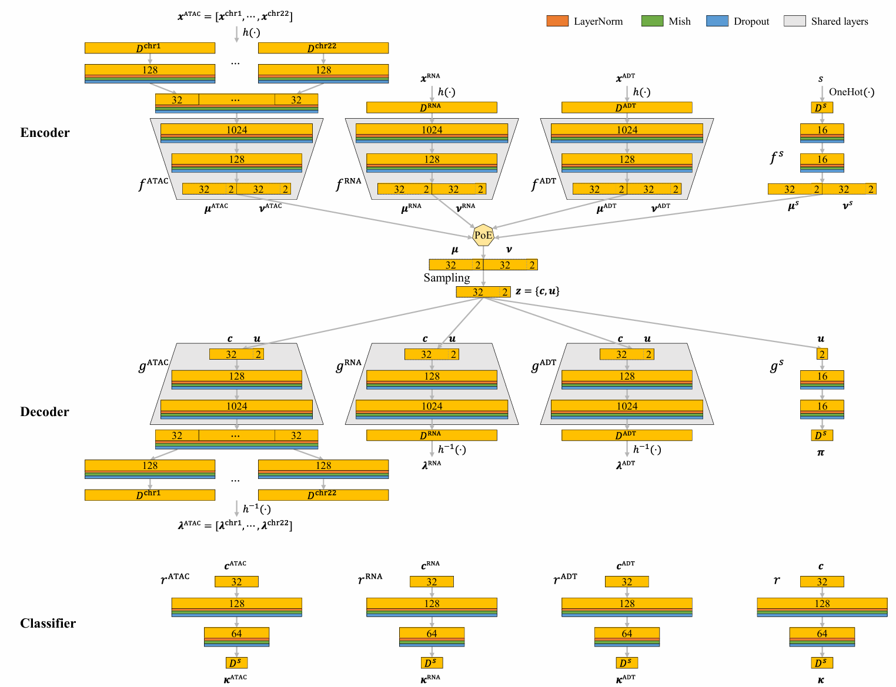

Extending MIDAS
===============

MIDAS ships with built-in support for RNA, ADT, and ATAC. If you want to
extend the model — add a new modality, swap a transformation, plug in a
new output distribution — this page walks you through the framework and
the extension points.

Framework overview
~~~~~~~~~~~~~~~~~~

MIDAS is configured via ``scmidas.load_config()`` and is built on
multi-layer perceptrons (MLPs). The model has five components:

Components
----------

1. **Data encoder** — encodes each modality into a Gaussian latent (mean and log-variance).
2. **Data decoder** — reconstructs each modality's counts from the joint latent.
3. **Batch ID encoder** — encodes batch indices into a Gaussian latent.
4. **Batch ID decoder** — reconstructs batch indices from the joint latent.
5. **Discriminator** — classifiers operating on modality-specific and joint latents (only the biological part ``c`` is fed to the discriminator).

.. note::

  MIDAS currently uses MLP-based encoders/decoders. Other architectures
  (CNN, transformer) are not built in but can be plugged in with custom
  modifications.

Network architecture:

Transformations and distributions
---------------------------------

MIDAS comes with a small registry of input transformations and output
distributions. Both registries are extensible for new modalities.

Transformations
^^^^^^^^^^^^^^^

A transformation is a pair ``(forward, inverse)`` applied around the
encoder/decoder so the model sees a numerically convenient
representation while still reconstructing the original counts.

Built-in pairs:

- **binarize**

  - Forward: ``x > 0`` (cast to binary).
  - Inverse: identity.
  - Default for ATAC.

- **log1p**

  - Forward: ``log(x + 1)``.
  - Inverse: ``exp(x) - 1``.
  - Default for RNA and ADT (via ``trsf_before_enc_rna`` /
    ``trsf_before_enc_adt`` in the configs).

.. note::

  Two places consume transformation names:

  - ``transform=`` argument to :class:`scmidas.MIDAS` — applied per
    minibatch in ``__getitem__`` and **not** inverted on the output side
    (used e.g. for ATAC binarization).
  - ``configs['trsf_before_enc_<mod>']`` — applied inside the encoder
    forward pass; the inverse is applied after the decoder, so the loss
    is computed in the original count space.

Distributions
^^^^^^^^^^^^^

A distribution registry entry bundles three pieces:

- **Loss function** — the reconstruction loss.
- **Sampling** — how to sample from the decoder's output parameters.
- **Activation** — the activation applied to the decoder's final layer.

Built-in distributions:

- **POISSON** — Poisson NLL loss; Poisson sampling; no output activation.
  Default for RNA and ADT counts.
- **BERNOULLI** — binary cross-entropy loss; Bernoulli sampling; sigmoid
  output. Default for ATAC.

Default configurations
~~~~~~~~~~~~~~~~~~~~~~

The defaults below are loaded by ``scmidas.load_config()``. Override any
key by mutating the dict before passing it to :class:`scmidas.MIDAS`:

.. code-block:: python

    from scmidas.config import load_config
    configs = load_config()
    configs['lam_dsc'] = 30          # tweak a single hyperparameter
    model = scmidas.MIDAS(mdata, configs=configs)

Embeddings
-----------

.. list-table:: 
    :widths: 6 6 30
    :header-rows: 1

    * - Key
      - Value
      - Description
    * - dim_c
      - 32
      - Latent dimension for biological information `c`.
    * - dim_u
      - 2
      - Latent dimension for technical information `u` (always be small to avoid capturing biological information).

Basic Network Structure (MLP)
-----------------------------

.. list-table:: 
    :widths: 6 6 30
    :header-rows: 1

    * - Key
      - Value
      - Description
    * - norm
      - 'ln'
      - Use layer normalization. 'bn', 'ln', or False.
    * - drop
      - 0.2
      - Dropout rate.
    * - out_trans
      - 'mish'
      - Activation function for the output. Support: 'tanh', 'relu', 'silu', 'mish', 'sigmoid', 'softmax', 'log_softmax'.

Shared Layers of Data Encoder and Decoder
-----------------------------------------

.. list-table:: 
    :widths: 6 6 30
    :header-rows: 1

    * - Key
      - Value
      - Description
    * - dims_shared_enc
      - [1024, 128]
      - Shared encoder structure across all modalities.
    * - dims_shared_dec
      - [128, 1024]
      - Shared decoder structure across all modalities.

RNA
---

.. list-table:: 
    :widths: 6 6 30
    :header-rows: 1

    * - Key
      - Value
      - Description
    * - trsf_before_enc_rna
      - 'log1p'
      - Apply log1p transformation before encoding. Exponential transformation will be applied after decoding.
    * - distribution_dec_rna
      - 'POISSON'
      - Poisson distribution assumption for decoder.

ADT
---

.. list-table:: 
    :widths: 6 6 30
    :header-rows: 1

    * - Key
      - Value
      - Description
    * - trsf_before_enc_adt
      - 'log1p'
      - Apply log1p transformation before encoding. Exponential transformation will be applied after decoding.
    * - distribution_dec_adt
      - 'POISSON'
      - Poisson distribution assumption for decoder.

ATAC
----

.. list-table:: 
    :widths: 6 6 30
    :header-rows: 1

    * - Key
      - Value
      - Description
    * - dims_before_enc_atac
      - [128, 32]
      - Independent MLP structure before shared encoder. It is used to compress the data chunks of the ATAC modality.
    * - dims_after_dec_atac
      - [32, 128]
      - Independent MLP structure after shared decoder. It expands the embeddings to reconstruct the ATAC modality.
    * - distribution_dec_atac
      - 'BERNOULLI'
      - Bernoulli distribution assumption for decoder. Use BCE loss.

Batch ID
-------------

.. list-table:: 
    :widths: 6 6 30
    :header-rows: 1

    * - Key
      - Value
      - Description
    * - s_drop_rate
      - 0.1 
      - Rate to drop batch Ids during training.
    * - dims_enc_s
      - [16, 16]
      - Encoder structure.
    * - dims_dec_s
      - [16, 16]
      - Decoder structure.
    * - dims_dsc
      - [128, 64]
      - Structure of the discriminator.

Training
--------

.. list-table:: 
    :widths: 6 6 30
    :header-rows: 1

    * - Key
      - Value
      - Description
    * - optim_net
      - 'AdamW'
      - Optimizer for the main network.
    * - lr_net
      - 1e-4
      - Learning rate for the main network.
    * - optim_dsc
      - 'AdamW'
      - Optimizer for the discriminator.
    * - lr_dsc
      - 1e-4
      - Learning rate for the discriminator.
    * - grad_clip
      - -1
      - Gradient clipping (``grad_clip>0`` means clipping).

Loss Weights
---------------------

.. list-table:: 
    :widths: 6 6 30
    :header-rows: 1

    * - Key
      - Value
      - Description
    * - lam_kld_c
      - 1
      - Weight for variable `c`'s KLD loss.
    * - lam_kld_u
      - 5
      - Weight for variable `u`'s KLD loss.
    * - lam_kld
      - 1
      - Weight for total KLD loss.
    * - lam_recon
      - 1
      - Weight for reconstruction loss.
    * - lam_dsc
      - 30
      - Weight for discriminator loss (for training the discriminator).
    * - lam_adv
      - 1
      - Weight for adversarial loss. `loss = VAE_loss - disc_loss * lam_adv`
    * - lam_alignment
      - 50
      - Weight for modality alignment loss.
    * - lam_recon_rna
      - 1
      - Weight for RNA reconstruction loss.
    * - lam_recon_adt
      - 1
      - Weight for ADT reconstruction loss.
    * - lam_recon_atac
      - 1
      - Weight for ATAC reconstruction loss.
    * - lam_recon_s
      - 1000
      - Weight for batch IDs reconstruction loss.

Discriminator Training
-----------------------

.. list-table:: 
    :widths: 6 6 30
    :header-rows: 1

    * - Key
      - Value
      - Description
    * - n_iter_disc
      - 3
      - Number of discriminator training iterations before training the VAE.

Data Loader
-----------

.. list-table:: 
    :widths: 6 6 30
    :header-rows: 1

    * - Key
      - Value
      - Description
    * - num_workers
      - 20
      - Number of worker threads for data loading.
    * - pin_memory
      - true
      - Load data into pinned memory.
    * - persistent_workers
      - true
      - Persistent worker threads.
    * - n_max
      - 10000
      - Maximum number of samples per batch.

Adding a new modality
~~~~~~~~~~~~~~~~~~~~~

Adding a modality means telling MIDAS how to encode it, how to decode
it, and how to score its reconstruction. The work is mostly
configuration; you only write code if your modality needs a
transformation or output distribution that isn't in the registry yet.

Step 1 — declare the modality in the configs
---------------------------------------------

Load the defaults, set the per-modality keys, and pass the dict to
:class:`scmidas.MIDAS`:

.. code-block:: python

    import scmidas
    from scmidas.config import load_config

    configs = load_config()

    # Optional: a forward/inverse transformation pair applied around the
    # encoder/decoder. Must already be in transform_registry (see Step 2).
    configs['trsf_before_enc_<mod>'] = 'log1p'

    # Optional: per-chunk encoder dimensions, e.g. when splitting by
    # chromosome (as ATAC does).
    configs['dims_before_enc_<mod>'] = [512, 128]
    configs['dims_after_dec_<mod>']  = [128, 512]

    # Required: output distribution. Must already be in
    # distribution_registry (see Step 2).
    configs['distribution_dec_<mod>'] = 'POISSON'

    # Optional: reconstruction-loss weight (default 1).
    configs['lam_recon_<mod>'] = 1

Then provide your data on the MuData and pass ``dims_x`` to
:func:`scmidas.MIDAS.setup_mudata` if the modality is split into chunks:

.. code-block:: python

    scmidas.MIDAS.setup_mudata(
        mdata,
        batch_key='batch',
        dims_x={'<mod>': [512, 512, 256]},   # only needed for chunked modalities
    )
    model = scmidas.MIDAS(mdata, configs=configs)

If the transformation or distribution name doesn't exist in the registry
the constructor raises an error — register it first (Step 2).

Step 2 — register a new transformation or distribution (if needed)
------------------------------------------------------------------

Both registries live in :mod:`scmidas.nn`.

Transformation:

.. code-block:: python

    from scmidas.nn import transform_registry

    def asinh5(x):
        import torch
        return torch.asinh(x / 5)

    def asinh5_inv(x):
        import torch
        return 5 * torch.sinh(x)

    transform_registry.register('asinh5', asinh5, asinh5_inv)

Distribution:

.. code-block:: python

    from scmidas.nn import distribution_registry

    def my_loss(pred, target):
        ...
    def my_sampler(params):
        ...
    def my_activation(x):
        ...

    distribution_registry.register('my_dist', my_loss, my_sampler, my_activation)

Once registered, the names are usable from ``configs`` exactly like the
built-in ``'log1p'`` / ``'POISSON'`` / ``'BERNOULLI'``.

Contributing
~~~~~~~~~~~~

Bug reports and feature requests are welcome via
`GitHub issues <https://github.com/labomics/midas/issues>`_. For code
contributions, branch from ``main``, make sure ``pytest tests/`` passes,
and open a pull request — for non-trivial changes, please open an issue
first to discuss the design.