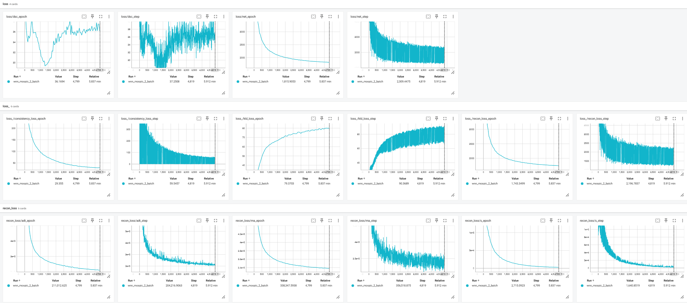

Visualizing Training Process with TensorBoard
==================================================

To visualize the training progress, you first need to integrate TensorBoard logging into the model in the training code snippet:

.. code-block:: python

    from lightning.pytorch import loggers as pl_loggers
    
    # Initialize TensorBoard logging
    tb_logger = pl_loggers.TensorBoardLogger(
        save_dir='./logs/', 
        version='task_version'  # Replace with a descriptive version name
    )

    # Configure the trainer for single-device training
    trainer = L.Trainer(
        logger=tb_logger,              # Attach the logger
    )

Next, to monitor the training process, run the following command in your terminal:

.. code-block:: python

    tensorboard --logdir './logs/lightning_logs'

Finally, open the URL displayed in your terminal (e.g., http://localhost:6006) in a web browser to visualize the training loss and results.

To visualize the embedding umap during training, you can set ``viz_umap_tb=True`` and ``n_save=your_desired_number_of_saves`` in  ``MIDAS.configure_data_from_dir()``.
This will enable the UMAP visualization in TensorBoard, allowing you to see how the embeddings evolve during training.
