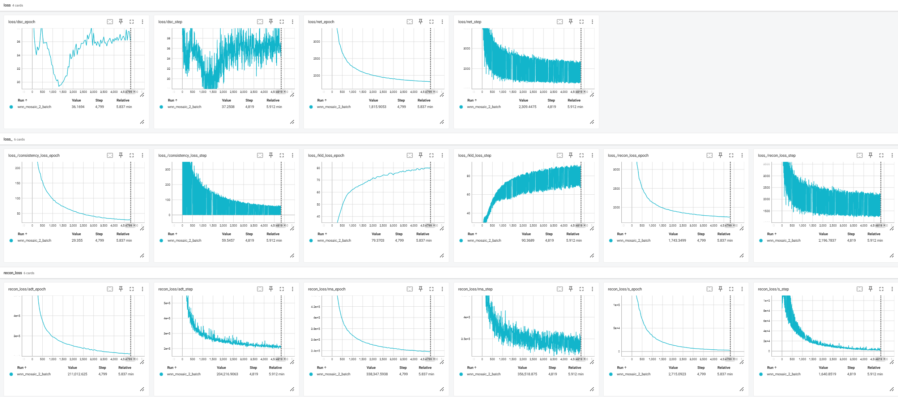

Visualizing the training process with TensorBoard
==================================================

PyTorch Lightning emits scalar logs for every training metric (recon, KLD,
discriminator, adversarial, alignment, ...). MIDAS hooks into this stream
through ``L.Trainer(logger=...)``, so you can pipe the metrics into
TensorBoard without modifying MIDAS itself.

Logging scalars
~~~~~~~~~~~~~~~

Pass a ``TensorBoardLogger`` to ``L.Trainer``, then forward the trainer
to ``model.train`` via ``logger=`` (which itself is forwarded to
``Trainer``). With the v0.3 API:

.. code-block:: python

    import scmidas
    from lightning.pytorch import loggers as pl_loggers

    scmidas.MIDAS.setup_mudata(mdata, batch_key='batch')
    model = scmidas.MIDAS(mdata)

    tb_logger = pl_loggers.TensorBoardLogger(
        save_dir='./logs/',
        version='my_run',  # any descriptive name
    )
    model.train(max_epochs=2000, logger=tb_logger)

Then in a terminal:

.. code-block:: bash

    tensorboard --logdir ./logs/lightning_logs

Open the URL (e.g. ``http://localhost:6006``) in a browser to watch the
loss curves update live.

Logging UMAPs of the joint latent during training
~~~~~~~~~~~~~~~~~~~~~~~~~~~~~~~~~~~~~~~~~~~~~~~~~

To also watch the joint biological latent ``z_c`` evolve as training
proceeds, pass ``viz_umap_tb=True`` (and a checkpointing interval) to
:class:`scmidas.MIDAS`:

.. code-block:: python

    model = scmidas.MIDAS(
        mdata,
        viz_umap_tb=True,
        n_save=200,           # write a UMAP every 200 epochs
    )
    model.train(max_epochs=2000, logger=tb_logger)

The UMAP image is added to the TensorBoard ``Images`` tab on each save
boundary.
